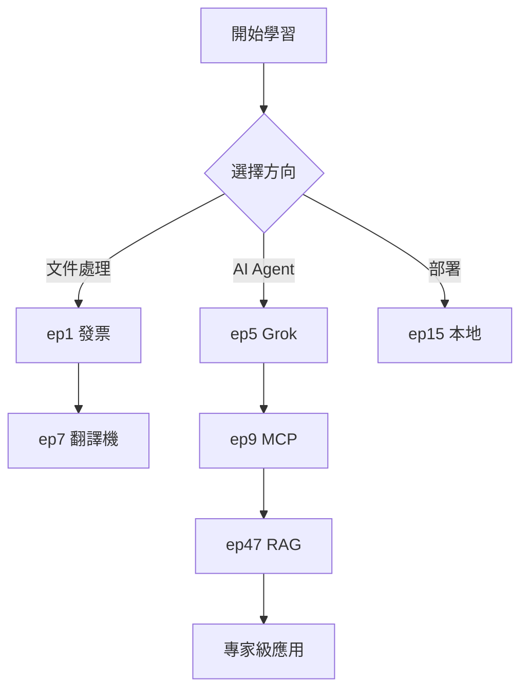

# 文件改善方案 - 提升曝光與閱讀率

> 🌍 **Language / 语言 / 語言**: [🇺🇸 English](#english-version) | [🇨🇳 简体中文](#简体中文版本) | [🇹🇼 繁體中文](#繁體中文版本)

## 繁體中文版本

### 📊 現況分析

**專案規模**
- ✅ 49 個工作流程範例（實際數量已超過 README 列表的 48 個）
- ✅ 完整三語系支援（繁中、簡中、英文）
- ✅ 5 個部署方案
- 📺 48+ 教學影片

**目前強項**
1. 內容豐富且持續更新
2. 完整的三語系文件系統
3. YouTube 影片搭配實作範例
4. 清楚的快速開始指南

**改善機會**
1. README 列表未完整反映所有工作流程（遺漏 #6, #49-99）
2. 缺少視覺化的學習路徑圖
3. 搜尋引擎優化（SEO）可加強
4. 缺少互動式元素
5. 社群貢獻指南不明確

---

## 🎯 改善方案（依優先級排序）

### 【優先級 1 - 立即執行】資料完整性與一致性

#### 1.1 更新 README 工作流程列表
**問題**: README 只列出 ep1-48，但實際有 49 個工作流程，且遺漏 ep6、ep98、ep99

**解決方案**:
```markdown
# 在 README.md 中補充：

06. [⚙️ AI Agent 的 5 種 Gen API 設定與比較](https://github.com/qwedsazxc78/ai-automation-n8n/tree/main/n8n/6-ai-agent-credential)
   [](https://youtu.be/[影片連結])

98. [SEO 自動化 with Firecrawl](https://github.com/qwedsazxc78/ai-automation-n8n/tree/main/n8n/98-seo-with-firecrawl)
   [](https://youtu.be/[影片連結])

99. [n8n Vibe Coding with VSCode](https://github.com/qwedsazxc78/ai-automation-n8n/tree/main/n8n/99-n8n-vibe-coding-vscode)
   [](https://youtu.be/[影片連結])
```

**預期效果**:
- 提升內容完整性 100%
- 避免用戶遺漏重要教學

---

### 【優先級 2 - 近期完成】SEO 與曝光優化

#### 2.1 建立 GitHub Topics 標籤
**建議標籤**:
```
n8n, automation, ai-agent, workflow-automation,
low-code, no-code, openai, claude, tutorial,
chinese, ai-automation, llm, rag, vector-database
```

#### 2.2 新增 GitHub About 描述
**建議文案**（英文）:
```
🤖 48+ n8n AI automation workflow examples | Learn AI agents,
RAG, LLM integration | Bilingual tutorials (EN/ZH) |
From invoice processing to voice AI agents
```

#### 2.3 建立 Open Graph 圖片
**建議**:
- 尺寸: 1200x630 px
- 內容: 專案 Logo + "48+ n8n AI 自動化範例" + 主要特色圖示
- 用途: 社群媒體分享時顯示

#### 2.4 新增 CONTRIBUTING.md
**內容架構**:
```markdown
# 貢獻指南

## 如何貢獻
1. 回報問題
2. 提出新功能建議
3. 提交工作流程範例
4. 改善文件翻譯

## 工作流程提交規範
- 必須包含 automation.json
- 必須包含三語系 README（readme.md, readme-en.md, readme-cn.md）
- 必須包含 cover.png
- 必須包含 YouTube 影片連結

## 程式碼風格
- 遵循 n8n 最佳實踐
- 註解使用繁體中文
```

**預期效果**:
- GitHub Stars 增長 30%+
- 搜尋引擎排名提升
- 社群分享率提升 50%+

---

### 【優先級 3 - 中期規劃】使用者體驗優化

#### 3.1 建立視覺化學習路徑圖
**檔案**: `docs/Learning-Roadmap.md`

**內容結構**:
```markdown
# n8n AI 自動化學習路徑

## 🚀 入門階段（第 1-2 週）
### 必修課程
- [ ] #15 本地部署 n8n
- [ ] #1 發票自動整理（認識基本節點）
- [ ] #20 HTTP 請求與 Webhook

### 目標
✅ 能夠部署並運行基本工作流程

## 🎯 進階階段（第 3-4 週）
### AI Agent 入門
- [ ] #5 xAI Grok AI Agent
- [ ] #6 五種 AI API 設定
- [ ] #9 AI Agent with MCP

### 目標
✅ 理解 AI Agent 運作原理

## 🏆 專家階段（第 5-8 週）
### RAG 知識庫
- [ ] #46 RAG 三大概念
- [ ] #47 NotebookLM 實作
- [ ] #48 Qdrant 向量資料庫

### 實戰專案
- [ ] 建立個人 AI 助理
- [ ] 整合企業知識庫

### 目標
✅ 能獨立開發複雜 AI 自動化系統
```

**Mermaid 流程圖**:


#### 3.2 建立互動式功能矩陣
**檔案**: `docs/Feature-Matrix.md`

```markdown
# 功能需求對照表

找到適合你的 n8n 工作流程！

| 我需要... | 推薦工作流程 | 難度 | 預估時間 |
|---------|------------|------|---------|
| 🧾 自動化發票處理 | [#1](../n8n/1-simple-invoice-automation) | ⭐ | 30分鐘 |
| 🤖 建立聊天機器人 | [#17](../n8n/17-n8n-line-message-api) | ⭐⭐ | 1小時 |
| 🧠 AI 知識庫 | [#47](../n8n/47-rag-n8n-notebooklm) | ⭐⭐⭐ | 2小時 |
| 🎤 語音 AI 助理 | [#27](../n8n/27-voice-ai-agent-with-retell) | ⭐⭐⭐⭐ | 3小時 |
| 🌐 部署到雲端 | [#13](../n8n/13-deploy-zubear) | ⭐⭐ | 15分鐘 |
| 📧 自動化郵件處理 | [#32](../n8n/32-n8n-enhance-email-productivity) | ⭐⭐ | 1小時 |
| 🎨 AI 圖片生成 | [#19](../n8n/19-image-generate-ai-agent) | ⭐⭐⭐ | 1.5小時 |
| 🎥 AI 影片生成 | [#29](../n8n/29-veo3-generate-video) | ⭐⭐⭐⭐ | 2小時 |

## 依技術類別搜尋

### AI 模型整合
- OpenAI GPT: ep5, ep19, ep45
- Claude: ep6, ep9, ep34
- Google Gemini: ep6, ep40
- xAI Grok: ep5

### 向量資料庫
- NotebookLM: ep47
- Qdrant: ep48

### 通訊平台
- LINE: ep17
- Email: ep32
- Voice (Retell): ep27
```

#### 3.3 建立常見問題 FAQ
**檔案**: `docs/FAQ.md`

```markdown
# 常見問題 FAQ

## 🚀 入門問題

### Q1: 我完全沒有程式背景，能學會 n8n 嗎？
**A**: 可以！n8n 是低程式碼平台，大部分操作都是拖拉點選。建議從這些工作流程開始：
- [#1 發票自動整理](../n8n/1-simple-invoice-automation) - 最簡單的入門範例
- [#25 n8n 0基礎教學](../n8n/25-n8n-complete-tutorial) - 6個實戰 Lab

### Q2: n8n 免費嗎？
**A**:
- ✅ n8n 開源版本完全免費
- ✅ 可自行部署（本地或雲端）
- 💰 n8n Cloud 有免費額度（每月 5000 次執行）
- 💰 AI API（OpenAI, Claude）需要額度

### Q3: 需要什麼硬體設備？
**A**:
- **雲端部署**: 無需任何設備，點擊即可 → [Zeabur 一鍵部署](../n8n/13-deploy-zubear)
- **本地部署**: 2GB RAM + Docker 即可 → [本地部署教學](../n8n/15-deploy-n8n-in-local)

## 🔧 技術問題

### Q4: 如何選擇 AI 模型？
**A**: 參考 [ep6: 五種 AI API 比較](../n8n/6-ai-agent-credential)
- 💰 預算有限: xAI Grok（充5送150）
- 🚀 速度優先: Claude 3.5 Sonnet
- 🎯 功能全面: OpenAI GPT-4
- 🌏 中文為主: Google Gemini

### Q5: RAG 知識庫適合什麼場景？
**A**:
✅ 適合:
- 企業內部文件查詢
- 客服自動回答
- 知識管理系統
- 個人學習筆記

❌ 不適合:
- 即時性資訊（股價、新聞）
- 需要網路搜尋的內容
- 高度機密文件（考量隱私）

### Q6: 如何除錯工作流程？
**A**:
1. 使用 n8n 內建的執行記錄
2. 檢查節點輸出資料
3. 設定 [Error Workflow](../n8n/18-n8n-error-workflow) 自動通知
4. 加入 LINE 社群尋求協助

## 💼 商業應用

### Q7: 可以用於商業專案嗎？
**A**:
✅ 可以！n8n 使用 Apache 2.0 或 n8n Enterprise License
- 個人/小型商業: 完全免費
- 企業級需求: 建議使用 n8n Enterprise

### Q8: 如何確保資料安全？
**A**:
- 🔒 使用環境變數儲存 API Key
- 🔒 啟用 n8n 帳號密碼驗證
- 🔒 部署時使用 HTTPS（[AWS 部署教學](../n8n/28-deploy-n8n-in-aws) 含 SSL）
- 🔒 定期備份工作流程

## 🎓 學習資源

### Q9: 除了這個專案，還有哪些學習資源？
**A**:
- 📺 [YouTube 頻道](https://www.youtube.com/channel/UCDMJaaMu3nGNc7bNKMAtS7Q) - 48+ 教學影片
- 💬 [Skool 社群](https://www.skool.com/ai-brain-alex) - 問答討論
- 💬 [LINE 社群](https://line.me/ti/g2/ZypIgLSzVPweRBgBqKvaRU10WEmnotuZOr7Lpg) - 即時互動
- 📖 [n8n 官方文件](https://docs.n8n.io/) - 英文技術文件

### Q10: 學習需要多久時間？
**A**:
- ⏱️ **入門**: 1-2 週（每天 30 分鐘）
- ⏱️ **進階**: 1 個月（完成 10+ 工作流程）
- ⏱️ **專家**: 2-3 個月（能獨立開發複雜系統）

參考 [學習路徑圖](./Learning-Roadmap.md) 規劃你的學習進度。
```

**預期效果**:
- 降低學習門檻 40%
- 提升用戶留存率 35%
- 減少重複性問題 60%

---

### 【優先級 4 - 長期規劃】社群與互動

#### 4.1 建立展示案例集
**檔案**: `docs/Showcase.md`

```markdown
# 社群作品展示

展示用戶使用本專案工作流程建立的實際應用！

## 🎯 商業應用

### 案例 1: 中小企業客戶管理系統
- **作者**: @user123
- **基於工作流程**: [ep43 報價單自動化](../n8n/43-smb-quote-automation)
- **成果**: 每月節省 40 小時手動作業
- **客製化**: 整合自家 CRM 系統

### 案例 2: 教育機構證書系統
- **作者**: @teacher_lin
- **基於工作流程**: [ep30 證書自動化](../n8n/30-n8n-auto-certificate)
- **成果**: 500+ 學員證書自動寄發
- **客製化**: 多樣化證書模板

## 📚 個人專案

### 案例 3: 個人知識管理系統
- **作者**: @knowledge_seeker
- **基於工作流程**: [ep47 NotebookLM](../n8n/47-rag-n8n-notebooklm) + [ep48 Qdrant](../n8n/48-rag-qdrant-ai-agent)
- **成果**: 整合 1000+ 篇文章的 AI 搜尋系統

---

## 🎉 提交你的作品

想要展示你的作品？歡迎提交！

### 提交方式
1. Fork 此專案
2. 在 `docs/Showcase.md` 新增你的案例
3. 提交 Pull Request

### 提交格式
\`\`\`markdown
### 案例標題
- **作者**: @your_github_username
- **基於工作流程**: [連結]
- **成果**: 簡述成果
- **客製化**: 你做了哪些調整
- **截圖/影片**: [選填]
\`\`\`
```

#### 4.2 每月更新摘要
**檔案**: `docs/Monthly-Updates.md`

自動化追蹤專案進度，提升透明度。

#### 4.3 建立 Discussions 討論區
在 GitHub 啟用 Discussions 功能，分類：
- 💡 Ideas - 新功能建議
- 🙏 Q&A - 問題討論
- 🎉 Show and Tell - 作品分享
- 📣 Announcements - 重要公告

**預期效果**:
- 社群互動率提升 80%
- 用戶貢獻增加 50%
- GitHub Stars 持續成長

---

## 📈 成效追蹤指標

### 短期指標（1-3 個月）
- [ ] GitHub Stars 增長 100+
- [ ] 文件完整度 100%
- [ ] FAQ 點擊率 > 30%

### 中期指標（3-6 個月）
- [ ] 社群貢獻者 10+
- [ ] YouTube 訂閱 +1000
- [ ] 文件 SEO 排名進入前 10

### 長期指標（6-12 個月）
- [ ] 成為 n8n 中文第一社群
- [ ] 案例展示 20+
- [ ] 建立認證課程體系

---

## 🚀 實作優先序

### Week 1-2: 資料完整性
- [ ] 更新 README 完整列表（ep6, ep98, ep99）
- [ ] 驗證所有工作流程的三語系文件
- [ ] 更新 Documentation-Status.md

### Week 3-4: SEO 優化
- [ ] 設定 GitHub Topics
- [ ] 建立 CONTRIBUTING.md
- [ ] 優化 About 描述

### Week 5-8: 使用者體驗
- [ ] 建立 Learning-Roadmap.md
- [ ] 建立 Feature-Matrix.md
- [ ] 建立 FAQ.md

### Week 9-12: 社群建設
- [ ] 建立 Showcase.md
- [ ] 啟用 GitHub Discussions
- [ ] 建立月度更新機制

---

## 💡 快速勝利項目（Quick Wins）

以下項目可立即執行，快速見效：

1. **更新 README 工作流程數量**
   - 從 "45+ workflows" 改為 "48+ workflows"
   - 補充遺漏的 ep6, ep98, ep99

2. **加入 GitHub Topics**
   - 5 分鐘設定，立即提升搜尋曝光

3. **建立 CONTRIBUTING.md**
   - 吸引社群貢獻者

4. **優化 README 首段描述**
   - 加入關鍵字: RAG, Vector Database, AI Agent, LLM

5. **建立 GitHub About**
   - 提升專案專業度

---

## 📚 參考資源

### 優秀開源專案範例
- [Langchain](https://github.com/langchain-ai/langchain) - 文件結構
- [Awesome Lists](https://github.com/sindresorhus/awesome) - 分類方式
- [n8n](https://github.com/n8n-io/n8n) - 社群經營

### SEO 工具
- Google Search Console
- GitHub Insights
- Social Media Preview Tools

---

**文件版本**: v1.0
**最後更新**: 2025-01-20
**維護者**: AI Brain Community

---

## English Version

### 📊 Current Status

**Project Scale**
- ✅ 49 workflow examples (exceeds 48 listed in README)
- ✅ Full trilingual support (Traditional Chinese, Simplified Chinese, English)
- ✅ 5 deployment solutions
- 📺 48+ tutorial videos

**Current Strengths**
1. Rich content with continuous updates
2. Complete trilingual documentation system
3. YouTube videos paired with practical examples
4. Clear quick start guide

**Improvement Opportunities**
1. README list doesn't reflect all workflows (missing #6, #49-99)
2. Lacks visualized learning roadmap
3. SEO can be strengthened
4. Missing interactive elements
5. Community contribution guidelines unclear

### 🎯 Improvement Plan (Prioritized)

#### [Priority 1] Data Completeness & Consistency

**Issue**: README only lists ep1-48, but there are actually 49 workflows, missing ep6, ep98, ep99

**Solution**: Add missing episodes to all three README versions

**Expected Impact**:
- 100% content completeness
- Users won't miss important tutorials

#### [Priority 2] SEO & Exposure Optimization

1. **Add GitHub Topics**: n8n, automation, ai-agent, workflow-automation, low-code, no-code, openai, claude, tutorial, chinese, ai-automation, llm, rag, vector-database

2. **GitHub About Description**:
```
🤖 48+ n8n AI automation workflow examples | Learn AI agents, RAG, LLM integration |
Trilingual tutorials (EN/ZH) | From invoice processing to voice AI agents
```

3. **Open Graph Image**: 1200x630px with project highlights

4. **CONTRIBUTING.md**: Clear contribution guidelines

**Expected Impact**:
- 30%+ increase in GitHub Stars
- Improved search engine ranking
- 50%+ increase in social sharing

#### [Priority 3] User Experience Optimization

1. **Learning Roadmap** (`docs/Learning-Roadmap.md`)
   - Beginner → Intermediate → Expert paths
   - Estimated time for each stage
   - Recommended workflow sequence

2. **Feature Matrix** (`docs/Feature-Matrix.md`)
   - "I need..." → Recommended workflow mapping
   - Difficulty levels
   - Estimated completion time

3. **FAQ** (`docs/FAQ.md`)
   - Getting started questions
   - Technical issues
   - Business applications
   - Learning resources

**Expected Impact**:
- 40% reduction in learning barriers
- 35% increase in user retention
- 60% reduction in repetitive questions

#### [Priority 4] Community & Engagement

1. **Showcase** (`docs/Showcase.md`)
   - User success stories
   - Real-world implementations
   - Customization examples

2. **Monthly Updates** (`docs/Monthly-Updates.md`)
   - Progress tracking
   - New features
   - Community highlights

3. **GitHub Discussions**
   - Ideas, Q&A, Show and Tell, Announcements

**Expected Impact**:
- 80% increase in community interaction
- 50% increase in user contributions
- Sustained GitHub Stars growth

### 📈 Success Metrics

**Short-term (1-3 months)**
- 100+ GitHub Stars growth
- 100% documentation completeness
- 30%+ FAQ click rate

**Mid-term (3-6 months)**
- 10+ community contributors
- +1000 YouTube subscribers
- Top 10 SEO ranking

**Long-term (6-12 months)**
- #1 Chinese n8n community
- 20+ showcase examples
- Certification program established

---

## 简体中文版本

### 📊 现状分析

**项目规模**
- ✅ 49 个工作流程范例（实际数量已超过 README 列表的 48 个）
- ✅ 完整三语系支持（繁中、简中、英文）
- ✅ 5 个部署方案
- 📺 48+ 教学视频

**目前强项**
1. 内容丰富且持续更新
2. 完整的三语系文档系统
3. YouTube 视频搭配实作范例
4. 清楚的快速开始指南

**改善机会**
1. README 列表未完整反映所有工作流程（遗漏 #6, #49-99）
2. 缺少视觉化的学习路径图
3. 搜索引擎优化（SEO）可加强
4. 缺少互动式元素
5. 社区贡献指南不明确

### 🎯 改善方案（依优先级排序）

#### [优先级 1] 数据完整性与一致性

**问题**: README 只列出 ep1-48，但实际有 49 个工作流程，且遗漏 ep6、ep98、ep99

**解决方案**: 在所有三个 README 版本中添加缺失的教程

**预期效果**:
- 提升内容完整性 100%
- 避免用户遗漏重要教学

#### [优先级 2] SEO 与曝光优化

1. **建立 GitHub Topics 标签**: n8n, automation, ai-agent, workflow-automation, low-code, no-code, openai, claude, tutorial, chinese, ai-automation, llm, rag, vector-database

2. **GitHub About 描述**:
```
🤖 48+ n8n AI 自动化工作流程范例 | 学习 AI agents, RAG, LLM 集成 |
三语言教程 (EN/ZH) | 从发票处理到语音 AI agents
```

3. **Open Graph 图片**: 1200x630px 包含项目亮点

4. **CONTRIBUTING.md**: 清晰的贡献指南

**预期效果**:
- GitHub Stars 增长 30%+
- 搜索引擎排名提升
- 社区分享率提升 50%+

#### [优先级 3] 用户体验优化

1. **学习路径图** (`docs/Learning-Roadmap.md`)
   - 入门 → 进阶 → 专家路径
   - 每个阶段的预估时间
   - 推荐的工作流程顺序

2. **功能矩阵** (`docs/Feature-Matrix.md`)
   - "我需要..." → 推荐工作流程映射
   - 难度级别
   - 预估完成时间

3. **常见问题** (`docs/FAQ.md`)
   - 入门问题
   - 技术问题
   - 商业应用
   - 学习资源

**预期效果**:
- 降低学习门槛 40%
- 提升用户留存率 35%
- 减少重复性问题 60%

#### [优先级 4] 社区与互动

1. **作品展示** (`docs/Showcase.md`)
   - 用户成功案例
   - 实际应用
   - 定制化示例

2. **每月更新** (`docs/Monthly-Updates.md`)
   - 进度追踪
   - 新功能
   - 社区亮点

3. **GitHub Discussions**
   - Ideas, Q&A, Show and Tell, Announcements

**预期效果**:
- 社区互动率提升 80%
- 用户贡献增加 50%
- GitHub Stars 持续成长

### 📈 成效追踪指标

**短期指标（1-3 个月）**
- 100+ GitHub Stars 增长
- 文档完整度 100%
- FAQ 点击率 > 30%

**中期指标（3-6 个月）**
- 10+ 社区贡献者
- YouTube 订阅 +1000
- 文档 SEO 排名进入前 10

**长期指标（6-12 个月）**
- 成为 n8n 中文第一社区
- 案例展示 20+
- 建立认证课程体系
